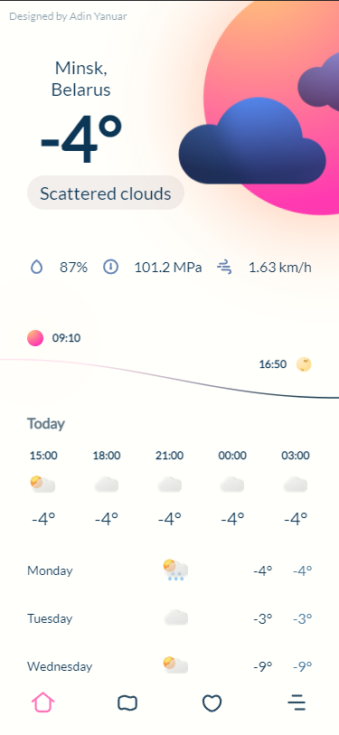
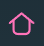
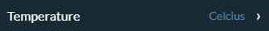
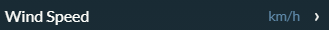
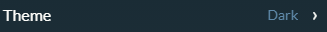

<h1 align="center">Innowise Weather</h1>

<div align="center">
  <div width="50%">
    <h3>Dark Mode</h3>
    
  </div>
  <div width="50%">
    <h3>Light Mode</h3>
    
  </div>
</div>

<h1 align="center">Task</h1>

<a href="https://docs.google.com/document/d/1GLfIU93NLco1XkdUXnje-kPpvEEal6Q_jCXv4keKU_U/edit#heading=h.cfna4so9wux2">Link on task</a>

<h1 align="center">How to use</h1>

|                                       Button                                       | Function                          |
| :--------------------------------------------------------------------------------: | --------------------------------- |
|   | Screen with main weather data     |
|    | Screen sith saved cities and info |
|          | Screen with location and settings |
|       | Field for search cities           |
|          | Button for edit saved cities list |
|  | Choose temperature unit           |
|   | Choose wind speed unit            |
|        | Choose theme mod                  |

<h1 align="center">How to run</h1>

<a href="https://skywebtehnol.ru/innowise-weather/">Live Demo</a>

```
    npm install
    npm run dev / npm run build
```

<h1 align="center">Structure</h1>

- Root folder
  - **mocks** / mocks assets for jest
  - .husky / folder for husky settings(pre-commit hook)
  - readme_assets / assets for README.md file
  - src / main project files
    -static / images
    -styles / styles for project modules
    - modules / project modules
      - Components / project components
      - helpers / additioanal js modules
      - pages / project pages
      - router / pages and url switcher
      - router.test / test files for router
      - Skyact / my implementation of React.js and react-dom
      - Skyax / project storage and actions with it (something like redux)

<h1 align="center">Naming</h1>

Files with a capital letter contains the class:

```
WeatherApp.js
```

Files with a small letter contain functions, variables, etc.

```
geolocation.js
```

Files with functions and classes at the same time divided into files with the appropriate name.

<h1 align="center">About test</h1>

Describtion of router.test file

```JavaScript
//import files for router
import Router from '../router';
import routes from '../router/routes';
import switcher from '../router/switcher';

import MainScreen from '../pages/MainScreen';
import CitySaved from '../pages/CitySaved';
import Menu from '../pages/Menu';

import RouterTester from './RouterTester'; //import custom tester

const ruoterTester = new RouterTester(Router, routes, switcher); //get an router object

ruoterTester.fillTestValues('', MainScreen); // add values for test router

ruoterTester.test(); // run test
```

run tests:

```
npm run test
```
