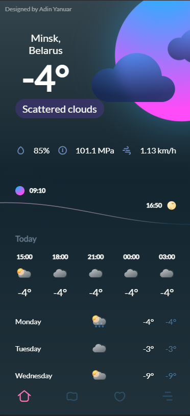

<!-- <h1 align="center">Innowise calculator</h1>
<h5 align="center">Only for sky calculations</h5>

<div align="center">
  <div width="50%">
    <h3>Dark Mode</h3>
    
  </div>
  <div width="50%">
    <h3>Light Mode</h3>
    
  </div>
</div>

<h1 align="center">Task</h1>

<a href="https://docs.google.com/document/d/1EBK8fXs3INFV7GJwYhnF4et83VpBeh4dy-5ZhMDob1U/edit#">Link on task</a>

<h1 align="center">How to use</h1>

|                                        Button                                        | Function                                                |
| :----------------------------------------------------------------------------------: | ------------------------------------------------------- |
|  | Theme changer                                           |
|        | Buttons for input numbers, work with keyboard           |
|            | Devision button, work with keyboard                     |
|           | Multiply button, work with keyboard                     |
|          | Minus button, work with keyboard                        |
|           | Plus button, work with keyboard                         |
|          | Equal button, repeat last operation, work with keyboard |
|          | Reset button, work with keyboard                        |
|     | Plus/minus button                                       |
|        | Devision second number by 100                           |
|             | Memory clear                                            |
|         | Add to memory                                           |
|        | Subtract from the memory                                |
|             | Write memory number                                     |
|       | Square                                                  |
|         | Cube                                                    |
|         | Power                                                   |
|         | e power                                                 |
|       | ten power                                               |
|        | Devide 1                                                |
|    | Square root                                             |
|      | Cube root                                               |
|         | Root                                                    |
|         | Factorial                                               |
|           | Previous operation                                      |
|                                                                                      |                                                         |

<h1 align="center">How to run</h1>

<a href="https://skywebtehnol.ru/innowise-calc/SPR/">Live Demo</a>

```
    npm install
    npm run dev / npm run build
```

<h1 align="center">Structure</h1>

- Root folder
  - .husky / folder for husky settings(pre-commit hook)
  - coverage / folder for jest testing data
  - readme_assets / assets for README.md file
  - src / main project files
    - modules / project modules
      - Commands / calculator commands
      - Commands.tests / tests of main functions
      - drawers / classes responsible for rendering
      - helpers / supporting modules

<h1 align="center">Naming</h1>

Files with a capital letter contains the class:

```
CalcMath.js
```

Files with a small letter contain functions, variables, etc.

```
buttonNames.js
```

Files with functions and classes at the same time divided into files with the appropriate name.

<h1 align="center">About test</h1>

Describtion of Command.test file

```JavaScript
import Command from '../Commands/Command'; //import of Command for test
import CommandsTester from './CommandsTester'; //import custom tester

const commandTester = new CommandsTester(Command); //get an tester object

commandTester.fillTestValues(operand1, operand2, operator, answerInOperand1); // add values for test command

commandTester.test(stringFromThrownError, precisionForFloatNumbers); // run test
```

run tests:

```
npm run test
``` -->
